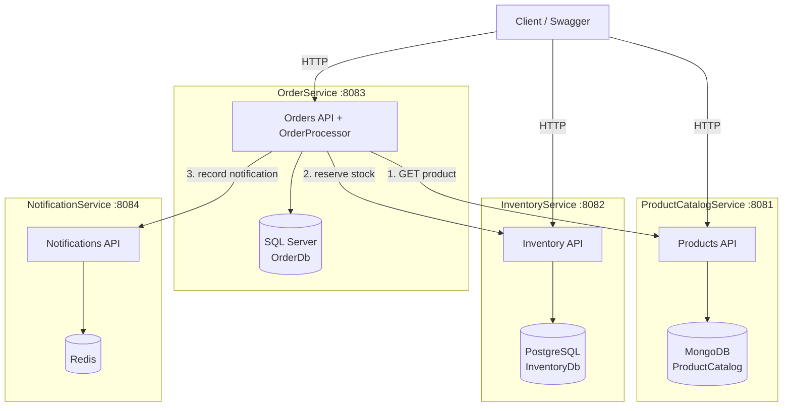
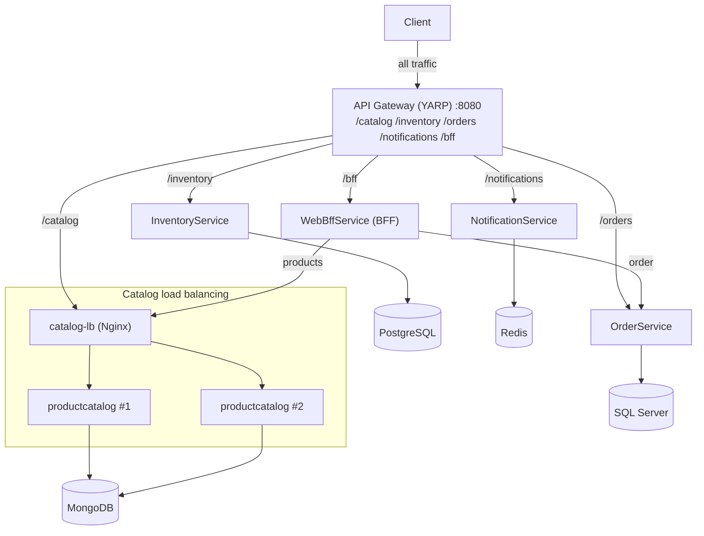
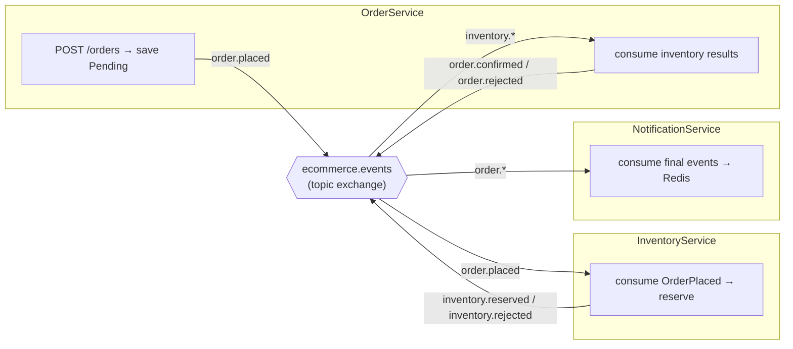

# Phase 2 — Microservices Architecture

Phase 1 was a single monolith with one SQL Server database. In Phase 2 we split
it into **four independent services**, each owning **its own database**
(database-per-service) with **polyglot persistence**. Services talk to each other
**synchronously over HTTP** (no message broker yet — that is Phase 4).

## Services and their databases

| Service | Responsibility | Database | Family | Host port |
|---|---|---|---|---|
| ProductCatalogService | Create/list/get/update products | MongoDB | Document | 8081 |
| InventoryService | Get/update/reserve/release stock | PostgreSQL | Relational | 8082 |
| OrderService | Place + read orders, orchestrate the flow | SQL Server | Relational | 8083 |
| NotificationService | Record/"send" notifications | Redis | Key-value | 8084 |

Each service exposes Swagger at its root (`http://localhost:<port>/`) and a
`/health` endpoint.

## Diagram



**Key rule:** every database arrow stays inside its own service box. No service
reads or writes another service's database — the only cross-service access is the
HTTP arrows out of OrderService.

## Order placement flow (synchronous)

1. Client calls `POST /api/orders` on **OrderService**.
2. For each line, OrderService calls **ProductCatalogService** `GET /api/products/{id}`
   to confirm the product exists, is active, and to snapshot its name + price.
3. For each line, OrderService calls **InventoryService** `POST /api/inventory/{productId}/reserve`.
   - If any reservation fails, previously reserved lines are released
     (`/release`) — a best-effort, synchronous compensation.
4. If all reservations succeed, OrderService saves a **Confirmed** order in its
   own SQL Server database; otherwise it saves a **Rejected** order with a reason.
5. OrderService calls **NotificationService** `POST /api/notifications` to record
   the outcome (Confirmed or Rejected). NotificationService stores it in Redis
   and logs the "sent" message.

## Endpoints

### ProductCatalogService (:8081)
- `POST /api/products`, `GET /api/products`, `GET /api/products/{id}`, `PUT /api/products/{id}`

### InventoryService (:8082)
- `GET /api/inventory/{productId}`
- `PUT /api/inventory/{productId}` (set/upsert quantities)
- `POST /api/inventory/{productId}/reserve`
- `POST /api/inventory/{productId}/release`

### OrderService (:8083)
- `POST /api/orders`, `GET /api/orders`, `GET /api/orders/{id}`

### NotificationService (:8084)
- `POST /api/notifications`, `GET /api/notifications`, `GET /api/notifications/{id}`

## What is intentionally NOT here yet

Async messaging and a real choreography saga (Phase 4), Redis cache-aside
(Phase 4), and monitoring + correlation IDs (Phase 5). Inter-service calls are
plain synchronous HTTP, which is acceptable "for now" per the course brief.

> **Phase 3 update:** API Gateway, BFF and load balancing have now been added —
> see the next section.

---

# Phase 3 — API Gateway, BFF & Load Balancing

Phase 3 puts an **API Gateway** in front of the Phase 2 services, adds a **BFF**
for client-specific aggregation, and runs **ProductCatalogService behind a load
balancer with 2 replicas**. The gateway is the **only** entry point exposed to
the host; every other service is internal to the Docker network.

## New components

| Component | Tech | Role | Exposed? |
|---|---|---|---|
| ApiGateway | YARP | Single entry point; routes by path prefix | **Yes — host :8080** |
| WebBffService | .NET 8 WebAPI | Aggregates order + product data for a web client | Internal (via `/bff`) |
| catalog-lb | Nginx | Load balances the ProductCatalogService replicas | Internal |
| productcatalog (×2) | .NET 8 WebAPI | 2 replicas behind catalog-lb | Internal |

## Diagram



Every database arrow still stays inside its own service — database-per-service is
unchanged. The only new traffic is through the gateway and the catalog LB.

## Gateway routes (YARP)

YARP strips the prefix and forwards the rest. All via `http://localhost:8080`:

| Gateway path | Forwarded to | Becomes |
|---|---|---|
| `/catalog/api/products/**` | catalog-lb → productcatalog | `/api/products/**` |
| `/inventory/api/inventory/**` | inventory | `/api/inventory/**` |
| `/orders/api/orders/**` | order | `/api/orders/**` |
| `/notifications/api/notifications/**` | notification | `/api/notifications/**` |
| `/bff/api/order-details/**` | webbff | `/api/order-details/**` |

## Gateway vs BFF — the boundary

- **Gateway (YARP):** generic, domain-agnostic **routing** and the single entry
  point. It maps one inbound path prefix to one backend and forwards the request
  unchanged. It is also where cross-cutting **edge** concerns belong (routing,
  and later rate limiting / auth). It never combines or reshapes domain data.
- **BFF (WebBffService):** **client-specific aggregation**. `order-details` is
  not one backend resource — the BFF calls OrderService *and*
  ProductCatalogService and composes a single response shaped for a web client.
  This domain knowledge must not leak into the gateway.

Rule of thumb: **fan-out-to-one → Gateway; fan-in-from-many → BFF.** The client
reaches the BFF *through* the gateway (`/bff/api/order-details/{id}`).

## Proving load balancing

ProductCatalogService stamps every response with an `X-Instance-Id` header (the
container hostname) and exposes `GET /api/products/instance`. With 2 replicas
behind Nginx:

```bash
# Repeated calls alternate between the two container ids:
for i in $(seq 1 10); do curl -s http://localhost:8080/catalog/api/products/instance; echo; done

# Or watch the response header:
curl -s -D - -o /dev/null http://localhost:8080/catalog/api/products | grep -i x-instance-id
```

**Resilience:** stop one replica and the gateway keeps serving from the other:

```bash
docker stop project-ai-productcatalog-1
curl -s http://localhost:8080/catalog/api/products/instance   # still 200, from the survivor
docker start project-ai-productcatalog-1
```

### Why Nginx with a DNS variable

Open-source Nginx resolves an `upstream server <name>` only once at startup,
which breaks with scaled replicas. The config uses Docker's embedded DNS resolver
(`127.0.0.11`) plus a variable in `proxy_pass`, so Nginx re-resolves the
`productcatalog` service name at request time; Docker returns all replica IPs and
rotates them, producing round-robin balancing. (Scale further with
`docker compose up -d --scale productcatalog=3`.)

---

# Phase 4 — Async Messaging, Saga & Caching

Phase 4 replaces the **synchronous** order flow with **asynchronous messaging**
over **RabbitMQ**, implemented as a **choreography saga**, and adds **Redis
cache-aside** to ProductCatalogService reads.

## What changed from Phase 3 → Phase 4

| | Phase 3 | Phase 4 |
|---|---|---|
| Order placement | OrderService calls Inventory + Notification over HTTP and returns the final status | OrderService saves **Pending**, publishes `OrderPlaced`, returns immediately |
| Inventory reservation | synchronous HTTP | event-driven (consumes `OrderPlaced`) |
| Notifications | synchronous HTTP | event-driven (consumes final events) |
| Final status | known at POST time | becomes Confirmed/Rejected **asynchronously** |
| ProductCatalog reads | MongoDB every time | **Redis cache-aside** (DB 1) |
| New infra | — | RabbitMQ (broker + management UI) |

OrderService still validates products **synchronously** against
ProductCatalogService during creation (a fast fail for a bad product id); only
inventory and notifications are event-driven.

## Messaging topology

- **Exchange:** `ecommerce.events` (durable, topic). **Messages:** persistent.
- **Queues:** durable; consumers use **prefetch=1** (one message at a time).



| Queue | Routing keys | Consumer |
|---|---|---|
| `inventory.order-placed` | `order.placed` | InventoryService |
| `order.inventory-results` | `inventory.reserved`, `inventory.rejected` | OrderService |
| `notification.order-final` | `order.confirmed`, `order.rejected` | NotificationService |

## Saga flow (choreography)

**Happy path:** `OrderPlaced` → Inventory reserves → `InventoryReserved` →
Order set **Confirmed** → `OrderConfirmed` → Notification records "Confirmed".

**Failure path:** `OrderPlaced` → Inventory has no stock (reserves **nothing**)
→ `InventoryRejected` → Order set **Rejected** → `OrderRejected` → Notification
records "Rejected". **Inventory is never decremented**, so no stock compensation
is required. Because the rejection happens *before* any reservation, this
choreography needs no reserve-then-release step; if a future step reserved stock
and then failed, an `InventoryReleased` event would be added here.

## Idempotency (at-least-once delivery)

RabbitMQ may deliver a message more than once, so every consumer is idempotent:

- **InventoryService** keeps a `ProcessedOrders` table (unique `OrderId`). If an
  `OrderPlaced` arrives for an already-processed order, it **re-publishes the
  stored outcome** instead of reserving stock again → no double reservation.
- **OrderService** only acts on an inventory result while the order is still
  `Pending`. A duplicate `InventoryReserved/Rejected` is ignored → no double
  status change and no duplicate downstream event.
- **NotificationService** does a Redis `SET notification:processed:{orderId} NX`;
  if the key already exists it skips → no duplicate notification.
- Consumers use **prefetch=1**, so each queue is processed sequentially, which
  keeps these guards race-free for the demo.

## Redis cache-aside (ProductCatalogService)

- Key `catalog:product:{id}` in Redis **logical DB 1** (NotificationService uses
  DB 0 — separate concerns, same Redis server).
- **Read** `GET /api/products/{id}`: hit → `CACHE HIT` from Redis; miss →
  `CACHE MISS`, read MongoDB, store with a 10-minute TTL.
- **Invalidation** on `PUT /api/products/{id}`: update MongoDB, then **delete**
  the key (`CACHE INVALIDATE`); the next read repopulates. The list endpoint is
  not cached, which keeps invalidation trivial.
- The cache is **shared across both catalog replicas**, so a miss on one replica
  populates the cache for the other.

## Phase 5 — Monitoring & Observability

### Structured logging → Seq

Every service uses **Serilog** (configured once via the shared
`builder.AddObservability("<ServiceName>")`) and writes structured events to:

- the **console** (for `docker logs`), and
- a central **Seq** aggregator (`datalust/seq`), reachable at
  **http://localhost:5341**. Inside the compose network services log to
  `http://seq` (env `Seq__ServerUrl`).

Every event is enriched with `Service`, and — via Serilog's `LogContext` / log
scopes — `CorrelationId` and (in saga handlers) `OrderId`. *Why Seq?* It is a
single small container, needs no schema/index setup, and its query box
(`CorrelationId = '...'`) makes the "trace one order" demo trivial — a better fit
for a course demo than a full ELK stack.

### Correlation ID — the design

The id is a single value that must survive **two kinds of hop**: HTTP and the
message broker. The implementation keeps the working saga almost untouched by
using an **ambient** `CorrelationContext` (an `AsyncLocal<string?>` in
`Shared.Messaging`) plus RabbitMQ's native `BasicProperties.CorrelationId`:

| Hop | How the id travels |
|---|---|
| Client → Gateway | `CorrelationIdMiddleware` reads `X-Correlation-ID`, or **creates** one. It writes the id back onto the request headers so **YARP forwards it** downstream, and echoes it on the response. |
| Gateway → service (HTTP) | Received in the header; the same middleware sets `CorrelationContext.Current` and pushes it into Serilog `LogContext`. |
| Service → service (HTTP) | `CorrelationPropagationHandler` (a `DelegatingHandler`) copies `CorrelationContext.Current` onto outgoing calls — Order→Catalog and BFF→Order/Catalog. |
| **Service → broker** | `EventPublisher` stamps `props.CorrelationId = CorrelationContext.Current` on **every** published event. |
| **Broker → service** | `RabbitMqConsumerBase` reads `ea.BasicProperties.CorrelationId`, sets `CorrelationContext.Current`, and opens a log scope — so the handler's logs **and any event it publishes** carry the same id. |

Because publish reads the ambient context and consume restores it, the id flows
`order.placed → inventory.reserved → order.confirmed` automatically, with **no
change to the saga method signatures**.

### Health & healthchecks

Each .NET service exposes `/health` (added in Phase 3) and has a docker-compose
`healthcheck`. The check is a **self-probe** — `dotnet <Service>.dll --healthcheck`
runs a short-lived process that GETs the container's own `/health` and exits 0/1.
This needs **no extra tooling** in the runtime image (no `curl`), which matters
because this machine's Docker build cannot reach external package feeds.

### One fully-traced saga (evidence)

Filtering Seq by `CorrelationId = 'PHASE5-DEMO-001'` for a single confirmed order
shows the complete timeline across services and the broker:

```
[ApiGateway]          Proxying to http://order:8080/api/orders ...
[OrderService]        Order 1002 created as Pending; publishing OrderPlaced.
[OrderService]        PUBLISH [order.placed]       CorrelationId=PHASE5-DEMO-001 {OrderId:1002,...}
[InventoryService]    CONSUME [order.placed]       CorrelationId=PHASE5-DEMO-001
[InventoryService]    Order 1002 stock RESERVED.
[InventoryService]    PUBLISH [inventory.reserved] CorrelationId=PHASE5-DEMO-001
[OrderService]        CONSUME [inventory.reserved] CorrelationId=PHASE5-DEMO-001
[OrderService]        Order 1002 CONFIRMED; publishing OrderConfirmed.
[OrderService]        PUBLISH [order.confirmed]    CorrelationId=PHASE5-DEMO-001
[NotificationService] CONSUME [order.confirmed]    CorrelationId=PHASE5-DEMO-001
[NotificationService] NOTIFICATION sent to obs@demo.com: order 1002 is Confirmed.
```

## How to test (also see README)

```bash
# Happy path: place an order, watch Pending → Confirmed
curl -X POST http://localhost:8080/orders/api/orders -H "Content-Type: application/json" \
  -d '{"customerEmail":"a@b.com","items":[{"productId":"<ID>","quantity":2}]}'
curl http://localhost:8080/orders/api/orders/<ORDER_ID>     # poll until Confirmed

# Failure path: order more than is in stock → Rejected, inventory unchanged
# Cache: GET the same product twice and watch the catalog logs:
docker logs project-ai-productcatalog-1 | grep CACHE
docker logs project-ai-productcatalog-2 | grep CACHE
```

## Demo evidence to capture

- **Saga happy path:** OrderService log "publishing OrderPlaced" → InventoryService
  "stock RESERVED" → OrderService "CONFIRMED" → NotificationService notification;
  plus the order changing Pending → Confirmed.
- **Compensation path:** InventoryService "REJECTED ... Stock left unchanged" →
  OrderService "REJECTED" → rejection notification; order Pending → Rejected.
- **Cache:** catalog logs showing `CACHE MISS` then `CACHE HIT`, and
  `CACHE INVALIDATE` after an update.
- **RabbitMQ management UI:** http://localhost:15672 (guest/guest) — the three
  queues and message rates.
- **Correlation trace (Phase 5):** Seq (http://localhost:5341) filtered by one
  `CorrelationId`, showing the full saga across Gateway → Order → Inventory →
  Order → Notification, including the broker `PUBLISH`/`CONSUME` events.

## ADRs

Database choices are justified in [docs/adr/](./adr):
- [0001 — ProductCatalogService → MongoDB](./adr/0001-productcatalog-mongodb.md)
- [0002 — OrderService → SQL Server](./adr/0002-orderservice-sqlserver.md)
- [0003 — InventoryService → PostgreSQL](./adr/0003-inventoryservice-postgresql.md)
- [0004 — NotificationService → Redis](./adr/0004-notificationservice-redis.md)
