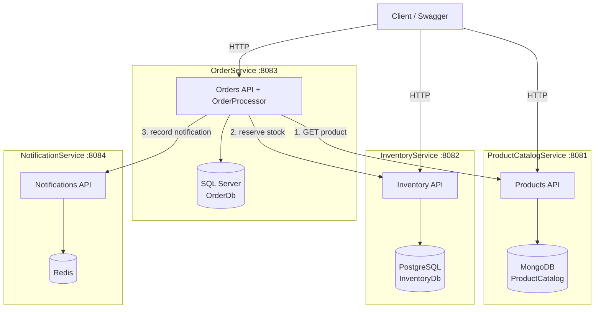

# Phase 2 — Microservices Architecture

Phase 1 was a single monolith with one SQL Server database. In Phase 2 we split
it into **four independent services**, each owning **its own database**
(database-per-service) with **polyglot persistence**. Services talk to each other
**synchronously over HTTP** (no message broker yet — that is Phase 4).

## Services and their databases

| Service | Responsibility | Database | Family | Host port |
|---|---|---|---|---|
| ProductCatalogService | Create/list/get/update products | MongoDB | Document | 8081 |
| InventoryService | Get/update/reserve/release stock | PostgreSQL | Relational | 8082 |
| OrderService | Place + read orders, orchestrate the flow | SQL Server | Relational | 8083 |
| NotificationService | Record/"send" notifications | Redis | Key-value | 8084 |

Each service exposes Swagger at its root (`http://localhost:<port>/`) and a
`/health` endpoint.

## Diagram

**Key rule:** every database arrow stays inside its own service box. No service
reads or writes another service's database — the only cross-service access is the
HTTP arrows out of OrderService.

## Order placement flow (synchronous)

1. Client calls `POST /api/orders` on **OrderService**.
2. For each line, OrderService calls **ProductCatalogService** `GET /api/products/{id}`
   to confirm the product exists, is active, and to snapshot its name + price.
3. For each line, OrderService calls **InventoryService** `POST /api/inventory/{productId}/reserve`.
   - If any reservation fails, previously reserved lines are released
     (`/release`) — a best-effort, synchronous compensation.
4. If all reservations succeed, OrderService saves a **Confirmed** order in its
   own SQL Server database; otherwise it saves a **Rejected** order with a reason.
5. OrderService calls **NotificationService** `POST /api/notifications` to record
   the outcome (Confirmed or Rejected). NotificationService stores it in Redis
   and logs the "sent" message.

## Endpoints

### ProductCatalogService (:8081)
- `POST /api/products`, `GET /api/products`, `GET /api/products/{id}`, `PUT /api/products/{id}`

### InventoryService (:8082)
- `GET /api/inventory/{productId}`
- `PUT /api/inventory/{productId}` (set/upsert quantities)
- `POST /api/inventory/{productId}/reserve`
- `POST /api/inventory/{productId}/release`

### OrderService (:8083)
- `POST /api/orders`, `GET /api/orders`, `GET /api/orders/{id}`

### NotificationService (:8084)
- `POST /api/notifications`, `GET /api/notifications`, `GET /api/notifications/{id}`

## What is intentionally NOT here yet

API Gateway and BFF (Phase 3), load balancing (Phase 3), async messaging and a
real choreography saga (Phase 4), Redis cache-aside (Phase 4), and monitoring +
correlation IDs (Phase 5). Inter-service calls are plain synchronous HTTP, which
is acceptable "for now" per the course brief.

## ADRs

Database choices are justified in [docs/adr/](./adr):
- [0001 — ProductCatalogService → MongoDB](./adr/0001-productcatalog-mongodb.md)
- [0002 — OrderService → SQL Server](./adr/0002-orderservice-sqlserver.md)
- [0003 — InventoryService → PostgreSQL](./adr/0003-inventoryservice-postgresql.md)
- [0004 — NotificationService → Redis](./adr/0004-notificationservice-redis.md)
